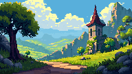
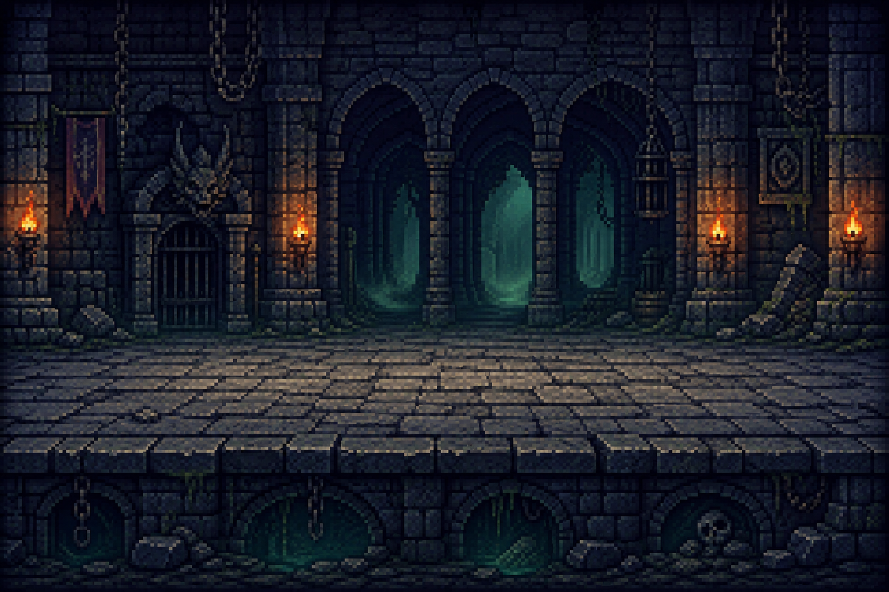
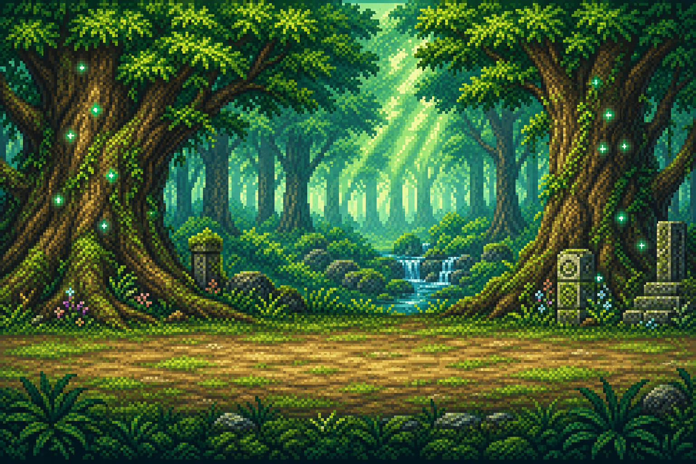
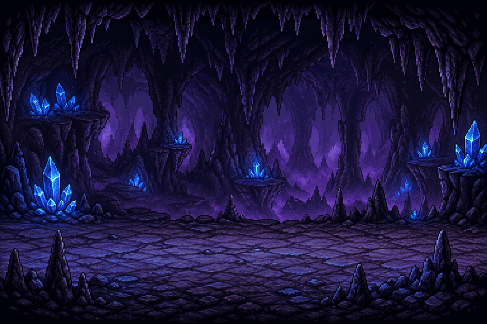

# 게임 기획서 (Game Design Document)

## 게임 제목

**Idle Quest** (판타지 방치형 RPG)

## 게임 개요

판타지 세계를 배경으로 영웅이 자동으로 몬스터를 처치하며 성장하는 방치형 RPG 게임이다.
플레이어는 영웅의 장비와 스탯을 강화하고, 스테이지를 클리어하며 더 강한 몬스터와 보스에 도전한다.
몬스터 처치 시 랜덤으로 장비가 드랍되며, 더 좋은 장비를 갖출수록 더 높은 스테이지에 도전할 수 있다.

## 게임 목적

- 스테이지를 진행하며 더 강한 몬스터를 처치한다.
- 골드를 모아 장비와 스탯을 업그레이드한다.
- 보스를 처치하고 다음 스테이지로 진행한다.
- 최종 스테이지 클리어를 목표로 한다.

## 조작 방법

- 마우스 좌클릭 : 버튼 선택 (업그레이드, 스테이지 이동 등)
- 전투는 자동으로 진행되며 플레이어가 직접 조작하지 않는다.

## 게임 규칙

- 영웅은 일정 시간마다 자동으로 현재 스테이지의 몬스터를 공격한다.
- 몬스터의 HP가 0이 되면 처치되고 골드와 경험치를 획득한다.
- 스테이지의 몬스터를 모두 처치하면 보스가 등장한다.
- 보스를 처치하면 다음 스테이지로 진행할 수 있다.
- 영웅의 HP가 0이 되면 현재 스테이지의 처음부터 다시 시작한다.
- 영웅의 HP는 전투 중 자동으로 천천히 회복된다.
- 몬스터 처치 시 일정 확률로 장비 아이템이 드랍된다. 드랍된 장비는 인벤토리에 저장되며 플레이어가 직접 장착 여부를 선택한다.
- 같은 등급의 장비 3개를 합성하면 한 단계 높은 등급의 장비 1개를 획득한다. 장비 등급은 일반 → 희귀 → 영웅 → 전설 순이다.

## 점수 / 승부 규칙

- 점수 개념 없이 최고 도달 스테이지로 진행도를 표시한다.
- 일반 몬스터 처치 : 골드 +10 ~ 50 (스테이지에 비례)
- 보스 처치 : 골드 +200 ~ 1000 (스테이지에 비례)

## 게임 시작 조건

- 게임 실행 후 타이틀 화면에서 시작 버튼을 누르면 게임이 시작된다.
- 영웅의 초기 스탯 : HP 100, 공격력 10, 방어력 5, 공격속도 1.0초
- 첫 스테이지(1-1)부터 시작하며 골드는 0에서 시작한다.

## 게임 종료 조건

- 별도의 게임 오버 없음 (HP 0이 되면 스테이지 초기화 후 재도전)
- 최종 스테이지(5-5) 보스 처치 시 엔딩 화면 출력
- 플레이어가 종료 버튼을 눌러 언제든지 종료 가능

## 플레이어 행동

- **자동 공격** : 일정 공격속도마다 현재 몬스터에게 자동으로 데미지를 입힌다.
- **자동 회복** : 전투 중 매 초 최대 HP의 1%씩 자동 회복한다.
- **업그레이드** : 골드를 소비하여 공격력, HP, 방어력, 공격속도를 강화한다.
- **장비 장착** : 몬스터 처치 시 랜덤으로 드랍되는 장비를 인벤토리에서 선택해 장착하여 스탯을 추가로 강화한다.
- **장비 합성** : 같은 등급의 장비 3개를 합성하면 더 높은 등급의 장비 1개로 만들 수 있다. 불필요한 장비를 정리하고 더 강한 장비를 얻는 수단이다.

## 적 / 장애물 / 아이템 행동

- **일반 몬스터** : 영웅을 향해 일정 시간마다 공격한다. 스테이지가 높을수록 HP와 공격력이 증가한다.
- **보스** : 일반 몬스터보다 HP와 공격력이 5배 높다. 스테이지 클리어 조건이다.
- **골드** : 몬스터 처치 시 자동으로 획득된다.
- **장비 드랍** : 몬스터 처치 시 일정 확률로 무기 또는 방어구가 드랍된다. 보스는 드랍 확률이 더 높다.

## 씬 구성

게임은 세 가지 씬으로 구성된다.

---

### 1. 시작 씬 (Title Scene)



| 구성 요소 | 설명 |
|----------|------|
| 배경 이미지 | 판타지 풍경 타이틀 배경 |
| 게임 제목 | 화면 중앙 상단에 "Idle Quest" 표시 |
| 시작 버튼 | 화면 중앙에 배치, 클릭 시 플레이 씬으로 전환 |
| 종료 버튼 | 시작 버튼 하단에 배치 |

**전환 조건** : 시작 버튼 클릭 → 플레이 씬

---

### 2. 플레이 씬 (Play Scene)

#### 전투 배경 (스테이지별)

| 스테이지 | 배경 이미지 |
|---------|-----------|
| 1~2 스테이지 (숲) |  |
| 3~4 스테이지 (던전) |  |
| 5 스테이지 (동굴) |  |

#### 화면 레이아웃

```
┌─────────────────────────────────────────────────────┐
│  [스테이지: 1-1]                   [골드: 0]         │
├──────────────┬────────────────────┬─────────────────┤
│              │                    │                 │
│   영웅        │     전투 배경       │   몬스터         │
│  [HP ████░]  │                    │  [HP ████░]     │
│              │                    │                 │
├──────────────┴────────────────────┴─────────────────┤
│  [공격력 강화]  [HP 강화]  [방어력 강화]  [공격속도 강화] │
│                                    [장착 장비 정보]   │
└─────────────────────────────────────────────────────┘
```

| 구성 요소 | 위치 | 설명 |
|----------|------|------|
| 스테이지 정보 | 상단 좌측 | 현재 스테이지 번호 표시 |
| 보유 골드 | 상단 우측 | 현재 골드량 표시 |
| 영웅 캐릭터 | 좌측 중앙 | 스프라이트 애니메이션 + HP 바 |
| 전투 배경 | 화면 중앙 | 스테이지에 따라 변경 |
| 몬스터 | 우측 중앙 | 스프라이트 애니메이션 + HP 바 |
| 업그레이드 패널 | 하단 | 클릭으로 스탯 강화 |
| 장착 장비 | 우측 하단 | 현재 장착 장비 아이콘 표시 |

**전환 조건** : 최종 보스 처치 → 종료 씬

---

### 3. 종료 씬 (End Scene)


| 구성 요소 | 설명 |
|----------|------|
| 배경 이미지 | 타이틀 배경 재사용 (어둡게 처리) |
| 클리어 메시지 | 화면 중앙 "QUEST CLEAR!" 텍스트 |
| 최종 스테이지 | 도달한 최고 스테이지 표시 |
| 처치 몬스터 수 | 총 처치한 몬스터 수 표시 |
| 다시 하기 버튼 | 클릭 시 시작 씬으로 복귀 |

**전환 조건** : 다시 하기 버튼 클릭 → 시작 씬

---

## 게임 화면 구성

- **좌측** : 영웅 캐릭터 및 HP 게이지
- **우측** : 몬스터 및 보스 HP 게이지
- **상단** : 현재 스테이지 정보, 보유 골드
- **하단** : 업그레이드 패널 (공격력, HP, 방어력, 공격속도 버튼)
- **우측 하단** : 현재 장착 장비 정보 표시

## 게임 진행 흐름

타이틀 → 게임 시작 → 스테이지 1-1 → 자동 전투 → 몬스터 처치 → 골드 획득 →
업그레이드 → 몬스터 전부 처치 → 보스 등장 → 보스 처치 → 다음 스테이지 진행 →
반복 → 최종 스테이지 클리어 → 엔딩

## 주요 게임 객체 목록

- **Hero** : 플레이어가 조작하는 영웅. 스탯, 장비, 자동 공격 로직 포함
- **Monster** : 일반 몬스터. HP, 공격력, 보상 골드 속성 포함
- **Boss** : Monster를 상속받는 클래스. HP와 공격력 배율이 높음
- **Stage** : 현재 스테이지 번호, 몬스터 목록, 보스 정보 관리
- **Equipment** : 무기/방어구 클래스. 장착 시 영웅 스탯에 수치 추가
- **Upgrade** : 업그레이드 항목 클래스. 현재 레벨, 비용, 효과 관리
- **GameManager** : 전체 게임 상태, 타이머, 골드 누적 관리
- **UIManager** : 화면 UI 갱신 담당

## 필요한 이미지 목록

### 배경

| 용도 | 파일 경로 |
|------|---------|
| 타이틀 / 엔딩 배경 | `resource/image/background/title_bg.png` |
| 전투 배경 - 숲 (스테이지 1~2) | `resource/image/background/battle_forest.png` |
| 전투 배경 - 던전 (스테이지 3~4) | `resource/image/background/battle_dungeon.png` |
| 전투 배경 - 동굴 (스테이지 5) | `resource/image/background/battle_cave.png` |

### 플레이어

| 용도 | 파일 경로 |
|------|---------|
| 영웅 공격 | `resource/image/player/colour1/nooutline/120x80_pngsheets/_Attack.png` |
| 영웅 콤보 공격 | `resource/image/player/colour1/nooutline/120x80_pngsheets/_AttackCombo.png` |
| 영웅 피격 | `resource/image/player/colour1/nooutline/120x80_pngsheets/` (관련 스프라이트) |

### 몬스터 (일반)

| 몬스터 | 파일 경로 |
|--------|---------|
| 고블린 (Idle/Attack/Death) | `resource/image/enemy/monsters_creatures_fantasy/goblin/` |
| 버섯몬스터 (Idle/Attack/Death) | `resource/image/enemy/monsters_creatures_fantasy/mushroom/` |
| 스켈레톤 (Idle/Attack/Death) | `resource/image/enemy/monsters_creatures_fantasy/skeleton/` |
| 비행눈 (Flight/Attack/Death) | `resource/image/enemy/monsters_creatures_fantasy/flying_eye/` |
| 박쥐 (Fly/Attack/Death) | `resource/image/enemy2/monsters_creatures_fantasy_2/bat/` |
| 쥐 (Idle/Attack/Death) | `resource/image/enemy2/monsters_creatures_fantasy_2/rat/` |
| 슬라임 (Idle/Attack/Death) | `resource/image/enemy2/monsters_creatures_fantasy_2/slime/` |
| 미믹 (Idle/Attack/Death) | `resource/image/enemy2/monsters_creatures_fantasy_2/mimic/` |

### UI

| 용도 | 파일 경로 |
|------|---------|
| 게임 아이콘 모음 | `resource/image/ui/free_icon_collection/1024_px/` |
| 대화창 / 정보창 테두리 | `resource/image/ui_border/game_info_and_dialogue_border/` |
| 게임 메뉴 UI | `resource/image/ui_menu/game_menu/` |

### 장비

| 용도 | 파일 경로 |
|------|---------|
| 초보 장비 아이콘 | `resource/image/weapon/equipment/amateur/` |
| 일반 장비 아이콘 | `resource/image/weapon/equipment/standard/` |
| 훈련용 장비 아이콘 | `resource/image/weapon/equipment/training/` |

## 필요한 사운드 목록

- 배경음악 (전투 BGM)
- 영웅 공격음
- 몬스터 피격음
- 보스 등장 효과음
- 업그레이드 효과음
- 골드 획득음
- 게임 클리어 효과음
