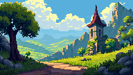

# 게임 기획서 (Game Design Document)

## 게임 제목

**Monster Memory** (몬스터 기억력 게임)

## 게임 개요

판타지 세계를 배경으로, 화면을 가로질러 빠르게 날아가는 몬스터들을 눈으로 추적한 뒤
**마지막으로 화면을 빠져나간 몬스터 종류**를 선택하는 기억력 · 반응속도 게임이다.
정답을 맞추면 플레이어 캐릭터가 해당 몬스터에게 달려가 공격하며 스테이지를 진행한다.

## 게임 목적

- 화면을 가로지르는 여러 몬스터 중 **마지막으로 빠져나간 종류**를 기억한다.
- 라운드를 거듭할수록 몬스터 수와 이동 패턴이 복잡해진다.
- 스테이지 1(숲) → 스테이지 2(던전) 를 모두 클리어한다.

## 조작 방법

- **마우스 좌클릭** : 타이틀 화면에서 시작 버튼 클릭 / 선택지 아이콘 클릭
- 라운드 진행(Watching 페이즈) 중에는 조작 없이 몬스터를 눈으로 관찰한다.
- 몬스터가 모두 빠져나가면 4개의 선택지 아이콘이 등장하고, 클릭으로 정답을 선택한다.

## 게임 규칙

- 각 라운드마다 여러 마리의 몬스터가 화면 왼쪽(또는 오른쪽)에서 등장해 반대편으로 날아가 사라진다.
- 몬스터의 이동 경로, 속도, 크기가 라운드마다 다르다.
- 모든 몬스터가 화면 밖으로 사라지면 **4종류의 선택지 아이콘**이 화면 중앙에 나타난다.
- 플레이어는 마지막으로 화면을 빠져나간 몬스터 종류를 선택한다.
- 정답 선택 시 플레이어 캐릭터가 해당 아이콘으로 달려가 공격 모션을 취하며 다음 라운드로 진행한다.
- 오답 선택 시 라이프(❤)가 1 감소하며 해당 몬스터 아이콘이 사망 애니메이션을 재생한다.
- 라이프가 0이 되면 게임 오버 후 타이틀 화면으로 복귀한다.

## 점수 / 승부 규칙

- 라이프 3개로 시작한다.
- 스테이지 1 : 라운드 1~5 클리어 → 스테이지 2로 진행
- 스테이지 2 : 라운드 1~5 클리어 → 전체 게임 클리어(AllClear)
- 모든 라운드를 라이프를 모두 잃지 않고 클리어하면 엔딩 화면 출력

## 게임 시작 조건

- 실행 후 타이틀 화면에서 **시작 버튼**을 클릭하면 스테이지 1 라운드 1부터 시작한다.
- 초기 라이프 : 3

## 게임 종료 조건

- **게임 오버** : 라이프가 0이 되면 타이틀 화면으로 복귀
- **게임 클리어** : 스테이지 2 라운드 5 정답 선택 후 AllClear 화면 출력

## 플레이어 행동

| 상태 | 설명 |
|------|------|
| **Idle** | 화면 왼쪽 하단(고정 위치)에서 대기. 10fps, 10프레임 루프 애니메이션 |
| **Run** | 선택한 아이콘 위치를 향해 700px/s 속도로 이동. 이동 방향에 따라 좌우 반전. 12fps, 10프레임 루프 |
| **Attack** | 목표 위치 도착 후 공격 모션 1회 재생(8fps, 4프레임). 완료 후 Idle 복귀 |

## 몬스터 행동

- 4종류의 몬스터가 등장한다 : **고블린, 눈알, 버섯, 해골**
- 각 몬스터는 화면 밖에서 출발해 화면 반대편 밖으로 사라지는 비행 경로를 따른다.
- 경로에 따라 사인파 진동(WaveAmp, WaveFreq)을 추가하여 불규칙한 움직임을 준다.
- 몬스터마다 등장 타이밍(SpawnAt), 속도(Speed), 크기(Scale)가 다르다.

### 몬스터 종류별 스프라이트

| 몬스터 | 비행 스프라이트 | 아이콘(Idle) | 피격(Dead) |
|--------|-------------|------------|-----------|
| 고블린 | `goblin/Flight.png` (8프레임) | `goblin/Idle.png` (4프레임) | `goblin/Dead.png` (4프레임) |
| 눈알 | `flying_eye/Flight.png` (8프레임) | `flying_eye/Idle.png` (8프레임) | `flying_eye/Dead.png` (4프레임) |
| 버섯 | `mushroom/Run.png` (8프레임) | `mushroom/Idle.png` (4프레임) | `mushroom/Dead.png` (4프레임) |
| 해골 | `skeleton/Walk.png` (4프레임) | `skeleton/Idle.png` (4프레임) | `skeleton/Dead.png` (4프레임) |

## 씬 구성

게임은 세 가지 씬으로 구성된다.

---

### 1. 시작 씬 (Title Scene)



| 구성 요소 | 설명 |
|----------|------|
| 배경 이미지 | 판타지 풍경 타이틀 배경 |
| 게임 제목 | 화면 중앙 상단에 텍스트 표시 |
| 시작 버튼 | 화면 중앙에 배치, 클릭 시 플레이 씬으로 전환 |

**전환 조건** : 시작 버튼 클릭 → 플레이 씬

---

### 2. 플레이 씬 (Play Scene)

#### 배경 (스테이지별)

| 스테이지 | 배경 이미지 |
|---------|-----------|
| 스테이지 1 (숲) | `resource/image/background/battle_forest.png` |
| 스테이지 2 (던전) | `resource/image/background/battle_dungeon.png` |

#### 화면 레이아웃

```
┌─────────────────────────────────────────────────────────────┐
│  [Stage 1  Round 1/5]              [❤ ❤ ❤]                 │
│                                                             │
│         ← 몬스터들이 화면을 가로질러 날아다님 →                 │
│                                                             │
│                                                             │
│  [플레이어]                                                  │
└─────────────────────────────────────────────────────────────┘
         ↓ (모든 몬스터 퇴장 후)
┌─────────────────────────────────────────────────────────────┐
│  마지막으로 나간 몬스터는?                                      │
│                                                             │
│        [고블린]   [눈알]   [버섯]   [해골]                    │
│                                                             │
│  [플레이어 → 선택 아이콘으로 달려가 공격]                        │
└─────────────────────────────────────────────────────────────┘
```

#### 페이즈 흐름

```
Watching → Choosing → Result → (StageClear / 다음 라운드)
                                      ↓
                                   AllClear
```

| 페이즈 | 설명 |
|--------|------|
| **Watching** | 몬스터들이 비행. 플레이어 조작 불가. 모든 몬스터 퇴장 시 Choosing으로 전환 |
| **Choosing** | 4개의 선택지 아이콘 표시. 클릭으로 정답 선택 |
| **Result** | 정답/오답 결과 표시 + 플레이어 공격 애니메이션 재생. 약 1.5초 후 다음 라운드 |
| **StageClear** | 스테이지 5라운드 완료 시 표시. 클릭으로 다음 스테이지 진행 |
| **AllClear** | 전체 클리어 시 표시 |

---

### 3. 결과 화면 (AllClear / GameOver)

| 상태 | 표시 내용 |
|------|---------|
| AllClear | "ALL CLEAR!" 텍스트 |
| GameOver | "GAME OVER" 텍스트 |

**전환 조건** : 클릭 시 타이틀 화면으로 복귀

---

## 스테이지 구성

### 스테이지 1 — 숲 (Forest)

- 배경 : `battle_forest.png`
- 라운드별 일반 몬스터 구성 (직선/곡선 경로, 다양한 속도·크기)
- 특별 기믹 없음

| 라운드 | 몬스터 수 | 특징 |
|--------|---------|------|
| 1 | 3마리 | 느린 속도, 크기 1.0~1.2 |
| 2 | 4마리 | 파형 경로 추가 |
| 3 | 5마리 | 동시 등장 간격 밀집 |
| 4 | 5마리 | 빠른 몬스터 혼합 |
| 5 | 6마리 | 크기 · 속도 혼합 |

### 스테이지 2 — 던전 (Dungeon)

- 배경 : `battle_dungeon.png`
- 라운드마다 특수 기믹(Shadow Trick / FastFinish Trick)이 포함된다.

| 라운드 | 몬스터 수 | 기믹 |
|--------|---------|------|
| 1 | 4마리 | Shadow Trick |
| 2 | 5마리 | FastFinish Trick |
| 3 | 6마리 | Shadow + 일반 혼합 |
| 4 | 6마리 | FastFinish + 일반 혼합 |
| 5 | 7마리 | Shadow + FastFinish 동시 |

---

## 특수 기믹 (Stage 2)

### Shadow Trick (그림자 트릭)

큰 몬스터(Scale 2.3) 뒤로 작은 몬스터(Scale 0.4)가 0.1초 간격으로 따라붙어,
큰 몬스터가 퇴장할 때까지 작은 몬스터가 가려진다.
큰 몬스터가 사라진 직후 작은 몬스터가 잠깐 노출되었다가 퇴장하므로
**정답은 작은 몬스터**가 된다.

```
[큰 몬스터(A)] ←  [작은 몬스터(B)]  (B는 A에 가려져 보이지 않음)
    → A 퇴장 → B 잠시 노출 → B 퇴장  → 정답 : B
```

### FastFinish Trick (빠른 마무리 트릭)

느린 몬스터(175px/s)가 거의 퇴장하는 순간, 빠른 몬스터(720px/s)가
경로 80% 지점에서 갑자기 등장해 느린 몬스터보다 **0.3초 뒤에** 퇴장한다.
마지막까지 살아남은 몬스터 처럼 보이다가 빠른 몬스터가 마지막을 가져가므로
**정답은 빠른 몬스터**가 된다.

```
느린 몬스터(A): ━━━━━━━━━━━━━━━━━━━━━━━━━━━━━━→ 퇴장
빠른 몬스터(B):                 ≫≫≫≫≫≫≫≫→ 퇴장(A 후 0.3초)
                                              정답 : B
```

---

## 주요 게임 객체

| 클래스/구조체 | 역할 |
|-------------|------|
| **FlightMob** | 비행 몬스터 1개 단위. 타입, 경로, 속도, 크기, 파형 진동, 경과 시간 관리 |
| **PlayerAnim** | 플레이어 상태 머신 (Idle / Run / Attack) |
| **GameScene** | 타이틀(Title) / 플레이(Play) 전환 |
| **Phase** | 라운드 내 페이즈 (Watching / Choosing / Result / StageClear / AllClear) |

---

## 필요한 이미지 목록

### 배경

| 용도 | 파일 경로 |
|------|---------|
| 타이틀 배경 | `resource/image/background/title_bg.png` |
| 전투 배경 - 숲 (스테이지 1) | `resource/image/background/battle_forest.png` |
| 전투 배경 - 던전 (스테이지 2) | `resource/image/background/battle_dungeon.png` |

### 플레이어

| 용도 | 파일 경로 |
|------|---------|
| Idle (10프레임, 120×80) | `resource/image/player/colour1/nooutline/120x80_pngsheets/_Idle.png` |
| Run (10프레임, 120×80) | `resource/image/player/colour1/nooutline/120x80_pngsheets/_Run.png` |
| Attack (4프레임, 120×80) | `resource/image/player/colour1/nooutline/120x80_pngsheets/_Attack.png` |

### 몬스터

| 몬스터 | 비행 | Idle | Dead |
|--------|------|------|------|
| 고블린 | `enemy/monsters_creatures_fantasy/goblin/Flight.png` | `goblin/Idle.png` | `goblin/Dead.png` |
| 눈알 | `enemy/monsters_creatures_fantasy/flying_eye/Flight.png` | `flying_eye/Idle.png` | `flying_eye/Dead.png` |
| 버섯 | `enemy/monsters_creatures_fantasy/mushroom/Run.png` | `mushroom/Idle.png` | `mushroom/Dead.png` |
| 해골 | `enemy/monsters_creatures_fantasy/skeleton/Walk.png` | `skeleton/Idle.png` | `skeleton/Dead.png` |

---

## 게임 진행 흐름

```
타이틀 화면
    ↓ (시작 버튼 클릭)
[Stage 1 Round 1~5]
    각 라운드: Watching → Choosing → Result
    라이프 감소 시 오답 처리, 0이 되면 GameOver
    ↓ (5라운드 클리어)
StageClear 화면
    ↓
[Stage 2 Round 1~5] (기믹 포함)
    ↓ (5라운드 클리어)
AllClear 화면
    ↓
타이틀 화면으로 복귀
```
